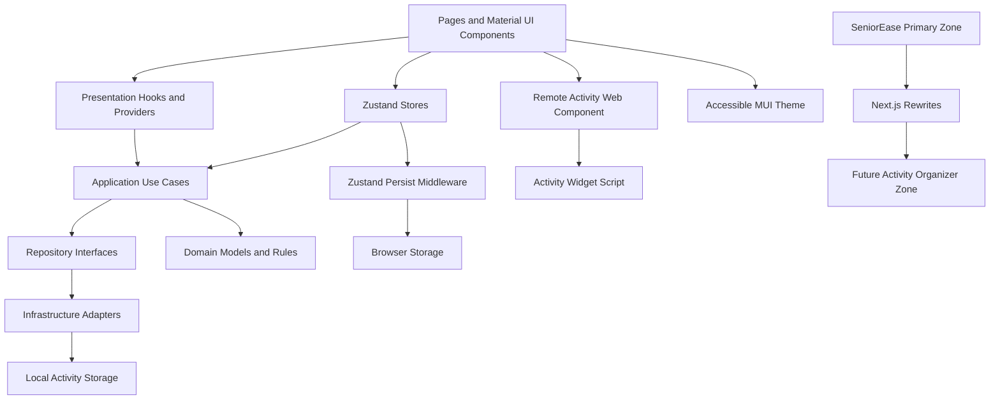

# SeniorEase Platform Design

**Spec**: `.specs/features/seniorease-platform/spec.md`
**Status**: Draft

---

## Architecture Overview

SeniorEase will be a Next.js 16 Pages Router app organized by Clean Architecture. Domain entities and application use cases stay independent from React, Next.js, Material UI, Zustand, and browser storage. Presentation modules call use cases through hooks and Zustand stores. Accessibility preferences are persisted with Zustand `persist`; business data such as activities can use repository adapters in v1 and can be replaced by API repositories later.



## Proposed Folder Structure

```text
src/
  domain/
    preferences/
    activities/
    profile/
  application/
    preferences/
    activities/
    profile/
    ports/
  infrastructure/
    storage/
    repositories/
  stores/
    preferences/
    activities/
  presentation/
    shared/
    personalization/
    activities/
    profile/
  pages/
    index.tsx
    atividades.tsx
    perfil.tsx
    configuracoes.tsx
  theme/
    designTokens.ts
    createSeniorEaseTheme.ts
```

## Material UI Theme From DESIGN.md

The theme will translate `DESIGN.md` tokens into Material UI configuration:

- Palette: `primary #1c1c1e`, `secondary #4262ff`, success `#00b473`, background `#ffffff` and `#f7f8fa`, text `#1c1c1e`.
- Accessible accents: yellow, teal, coral, and rose are reserved for tags, status panels, and supportive visual grouping.
- Typography: use `Roobert PRO` when available, with fallback to `Noto Sans`, system UI, and sans-serif.
- Shape: pill buttons use full radius, inputs use 8px radius, repeated cards and panels use 8px or local MUI defaults unless the design token explicitly calls for larger feature panels.
- Spacing: base spacing uses 4px/8px increments from `DESIGN.md`, expanded by user spacing preference.
- Accessibility adaptations: contrast and font-size preferences produce theme variants at runtime.

## ARIA Accessibility Premises

SeniorEase will validate accessibility through ARIA-compatible behavior and native semantics:

- Prefer native HTML semantics before adding ARIA roles.
- Every interactive control must have an accessible name through visible text, `aria-label`, or `aria-labelledby`.
- Form controls must have programmatic labels and helper/error text connected with `aria-describedby` where needed.
- Dialogs must use dialog semantics, set an accessible title, trap focus while open, and return focus to the triggering control when closed.
- Positive feedback and completion messages must use polite live regions; destructive or blocking errors may use assertive live regions sparingly.
- Guided steps must expose current step, progress, and completion state in text and accessible state, not only color.
- Navigation must preserve predictable focus order and keyboard operation.

## Microfrontend Recommendation

Keep `seniorease-web` as the primary Next.js 16 Pages Router zone. Extract the activity organizer into a future Next.js zone because it has clear route ownership, user-facing value, and limited dependency on profile/settings outside preference context.

Suggested future topology:

- Primary zone app: `seniorease-web`
- Activity zone app: `seniorease-activities`
- Activity zone path ownership: `/atividades` and nested `/atividades/:path*`
- Activity zone asset prefix: `/atividades-static`
- Primary zone integration surface: Next.js `rewrites()` routing `/atividades/:path*` and `/atividades-static/:path*` to the activity zone origin.
- Shared contracts: route contract, preference context shape, theme token package or copied token contract, repository/API boundary, and accessibility guarantees.
- Primary zone fallback: render local `ActivityOrganizer` during v1 or a clear unavailable-state message if the activity zone cannot be reached.
- Local mode: the same organizer must render inside `seniorease-web` while the zone is not yet split.

In this project, SeniorEase is the primary zone. The separate activity organizer app can later run independently and be reached through Multi-Zone rewrites instead of bundler-level Module Federation.

## Remote Subsection Web Components

Multi-Zones are used for full page or route ownership. When a page rendered by `seniorease-web` needs to embed a remote activity subsection inside the primary layout, SeniorEase will use a Web Component widget loaded by script.

Contract rules:

- Complex input data uses JavaScript properties on the custom element.
- Simple configuration uses HTML attributes, such as `data-mode="simplified"`.
- Callback-like output uses `CustomEvent` with a typed `detail` payload.
- The primary page owns layout, headings, landmarks, fallback UI, and event listeners.
- The remote widget owns only its internal activity subsection behavior.
- The widget must remain usable with keyboard navigation and must not trap focus outside dialogs.

Primary-zone page example:

```tsx
import Script from 'next/script'
import { useEffect, useRef } from 'react'

type ActivityWidgetElement = HTMLElement & {
  preferences?: UserPreferences
}

export function DashboardActivitySection({
  onActivityComplete,
  preferences,
}: DashboardActivitySectionProps) {
  const widgetRef = useRef<ActivityWidgetElement>(null)

  useEffect(() => {
    const element = widgetRef.current
    if (!element) return

    element.preferences = preferences

    const handleComplete = (event: Event) => {
      const { activityId } = (event as CustomEvent<{ activityId: string }>).detail
      onActivityComplete(activityId)
    }

    element.addEventListener('activity-complete', handleComplete)

    return () => {
      element.removeEventListener('activity-complete', handleComplete)
    }
  }, [onActivityComplete, preferences])

  return (
    <section aria-labelledby="activities-title">
      <h2 id="activities-title">Atividades</h2>

      <Script
        src="https://activities.seniorease.app/widgets/activity-organizer.js"
        strategy="afterInteractive"
      />

      <seniorease-activity-organizer
        ref={widgetRef}
        data-mode="simplified"
      />
    </section>
  )
}
```

Remote Web Component example:

```typescript
class SeniorEaseActivityOrganizer extends HTMLElement {
  preferences?: UserPreferences

  completeActivity(activityId: string) {
    this.dispatchEvent(
      new CustomEvent('activity-complete', {
        detail: { activityId },
        bubbles: true,
        composed: true,
      }),
    )
  }
}

customElements.define('seniorease-activity-organizer', SeniorEaseActivityOrganizer)
```

## Components and Interfaces

### Preference

- **Purpose**: Represent accessible UI settings.
- **Location**: `src/domain/preferences/Preference.ts`
- **Interfaces**:
  - `createDefaultPreferences(): UserPreferences`
  - `validatePreferences(input: unknown): UserPreferences`
- **Dependencies**: None.
- **Reuses**: `DESIGN.md` token values through presentation theme mapping only, not inside domain.

### Activity

- **Purpose**: Represent a task with guided steps, reminder text, status, and completion metadata.
- **Location**: `src/domain/activities/Activity.ts`
- **Interfaces**:
  - `createActivity(input: CreateActivityInput): Activity`
  - `completeActivity(activity: Activity): Activity`
  - `addActivityStep(activity: Activity, step: ActivityStep): Activity`
- **Dependencies**: None.

### Preference State Port

- **Purpose**: Define the application contract for reading and updating validated preferences without coupling use cases to Zustand.
- **Location**: `src/application/ports/PreferenceStatePort.ts`
- **Interfaces**:
  - `getPreferences(): UserPreferences`
  - `setPreferences(preferences: UserPreferences): void`
  - `resetPreferences(): void`
- **Dependencies**: Domain preferences.

### ActivityRepository Port

- **Purpose**: Define persistence contract for activities and history.
- **Location**: `src/application/ports/ActivityRepository.ts`
- **Interfaces**:
  - `listActivities(): Promise<Activity[]>`
  - `saveActivity(activity: Activity): Promise<void>`
  - `deleteActivity(activityId: string): Promise<void>`
  - `listCompletedActivities(): Promise<Activity[]>`
- **Dependencies**: Domain activities.

### Use Cases

- **Purpose**: Encapsulate app behavior independent from UI.
- **Location**: `src/application/**/useCases/`
- **Interfaces**:
  - `LoadPreferencesUseCase.execute(): UserPreferences`
  - `SavePreferencesUseCase.execute(preferences: UserPreferences): void`
  - `CreateActivityUseCase.execute(input: CreateActivityInput): Promise<Activity>`
  - `CompleteActivityUseCase.execute(activityId: string): Promise<Activity>`
  - `ListActivitiesUseCase.execute(): Promise<Activity[]>`
- **Dependencies**: Application ports and domain models.

### PreferenceStore

- **Purpose**: Manage accessibility preference state and persistence through Zustand `persist`.
- **Location**: `src/stores/preferences/usePreferenceStore.ts`
- **Interfaces**:
  - `preferences: UserPreferences`
  - `setPreferences(preferences: UserPreferences): void`
  - `resetPreferences(): void`
  - `hasHydrated: boolean`
- **Dependencies**: Zustand, `persist`, domain preference defaults, validation, and `PreferenceStatePort`.
- **Reuses**: `createDefaultPreferences` and `validatePreferences`.

### ActivityStore

- **Purpose**: Coordinate activity UI state with activity use cases and repositories.
- **Location**: `src/stores/activities/useActivityStore.ts`
- **Interfaces**:
  - `activities: Activity[]`
  - `completedActivities: Activity[]`
  - `loadActivities(): Promise<void>`
  - `createActivity(input: CreateActivityInput): Promise<void>`
  - `completeActivity(activityId: string): Promise<void>`
- **Dependencies**: Zustand and activity use cases.

### Activity Storage Adapters

- **Purpose**: Implement activity repository ports for v1 business-data persistence.
- **Location**: `src/infrastructure/repositories/`
- **Interfaces**:
  - `LocalActivityRepository implements ActivityRepository`
- **Dependencies**: Browser storage guarded for SSR.

### PersonalizationDashboard

- **Purpose**: Provide controls for all accessibility preferences.
- **Location**: `src/presentation/personalization/PersonalizationDashboard.tsx`
- **Interfaces**:
  - `PersonalizationDashboardProps`
  - `onPreferenceChange(preferences: UserPreferences): void`
- **Dependencies**: Material UI controls, preference hooks.
- **Accessibility**: Controls expose accessible names, labels, helper text, keyboard operation, and status feedback through live regions.

### ActivityOrganizer

- **Purpose**: Show simple task list, guided steps, reminders, completion feedback, and history.
- **Location**: `src/presentation/activities/ActivityOrganizer.tsx`
- **Interfaces**:
  - `ActivityOrganizerProps`
  - `onCreateActivity(input: CreateActivityInput): Promise<void>`
  - `onCompleteActivity(activityId: string): Promise<void>`
- **Dependencies**: Activity hooks, Material UI components, feedback service.
- **Accessibility**: List, guided steps, dialogs, and completion feedback follow ARIA premises for roles, names, focus, and live regions.

### ProfileSettings

- **Purpose**: Display profile and persisted settings summary.
- **Location**: `src/presentation/profile/ProfileSettings.tsx`
- **Interfaces**:
  - `ProfileSettingsProps`
- **Dependencies**: Preference hooks, reminder preference controls.

## Data Models

### UserPreferences

```typescript
type FontScale = 'small' | 'medium' | 'large' | 'extraLarge'
type ContrastLevel = 'standard' | 'high' | 'maximum'
type SpacingLevel = 'comfortable' | 'wide' | 'extraWide'
type NavigationMode = 'simplified' | 'standard'

interface UserPreferences {
  fontScale: FontScale
  contrastLevel: ContrastLevel
  spacingLevel: SpacingLevel
  navigationMode: NavigationMode
  reinforcedFeedback: boolean
  extraConfirmation: boolean
  remindersEnabled: boolean
  reminderTone: 'direct' | 'gentle'
}
```

### Activity

```typescript
type ActivityStatus = 'pending' | 'inProgress' | 'completed'

interface ActivityStep {
  id: string
  label: string
  completed: boolean
}

interface Activity {
  id: string
  title: string
  description?: string
  reminderText?: string
  status: ActivityStatus
  steps: ActivityStep[]
  createdAt: string
  completedAt?: string
}
```

## Error Handling Strategy

| Error Scenario | Handling | User Impact |
| --- | --- | --- |
| Zustand persistence unavailable | Use in-memory preference state for current session | Clear warning that settings may not be saved |
| Invalid persisted preference data | Validate and reset to accessible defaults | App loads without crash |
| Activity storage unavailable | Keep current session activity state in memory | Clear warning that activity history may not be saved |
| Activity creation with empty title | Validate before use case execution | Inline helper text asks for a clear title |
| Critical action with extra confirmation | Require confirmation dialog | User avoids accidental deletion or reset |
| Largest font causes overflow risk | Use wrapping, responsive grid, and min target sizes | Content remains readable and reachable |
| Activity organizer zone unavailable | Render local fallback or unavailable-state message | Primary zone remains stable and understandable |
| Remote activity widget unavailable | Render local fallback subsection or unavailable-state message | Primary page remains understandable and keyboard-accessible |

## Tech Decisions

| Decision | Choice | Rationale |
| --- | --- | --- |
| Framework and router | Next.js 16 with Pages Router | Explicit project requirement and compatible with the chosen local-first architecture. |
| Architecture | Clean Architecture by layer and feature area | Keeps domain/use cases testable and UI-independent. |
| UI Kit | Material UI | Explicit requirement and strong accessibility primitives. |
| State management | Zustand | Required project decision; keeps client state small and explicit. |
| Preference persistence | Zustand `persist` | Required project decision for accessibility preferences. |
| Activity persistence | Local activity repository for v1 | Demonstrates business-data persistence without backend scope. |
| Theme | Runtime MUI theme generated from `DESIGN.md` tokens plus user preferences | Enables real font, contrast, and spacing changes. |
| Accessibility validation | ARIA premises plus keyboard and focus checks | Ensures accessibility is testable, not only visual. |
| Microfrontend boundary | SeniorEase as primary zone routing to a future Activity Organizer zone with Next.js Multi-Zones | Follows the Next.js documentation recommendation for microfrontends and avoids unsupported Module Federation coupling in Next.js 16. |
| Remote subsections | Web Component widgets loaded by script, with JavaScript properties for complex input, HTML attributes for simple config, and `CustomEvent` for output | Enables embedded remote subsections inside primary-zone pages without importing runtime React components across Next.js apps. |
| CI Node version | Node.js 20+ | Required project decision. |
